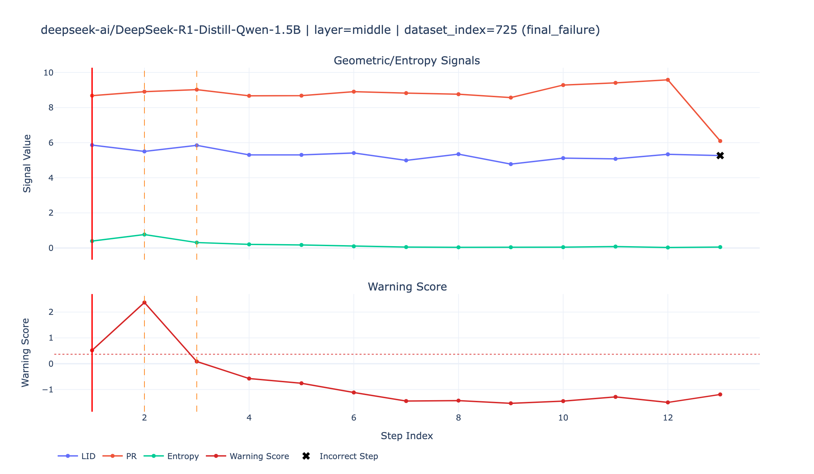

# Geometry of Reasoning

Training-free geometric diagnostics for early detection of reasoning derailment in LLM chain-of-thought trajectories.

## Scope

- Step-level reasoning traces on GSM8K
- Hidden-state geometry signals: LID (MLE, TwoNN, ABID), Participation Ratio
- Uncertainty signal: conditional entropy
- Offline symbolic checking with SymPy
- "Reasoning Seismograph" visualization

## Project Layout

```text
src/
  generation/
  metrics/
  evaluation/
  visualization/
configs/
scripts/
tests/
docs/
```

## Environment (Poetry)

```bash
poetry install
poetry shell
```

Optional quantization dependency (for `GOR_QUANTIZATION` on supported CUDA setups):

```bash
poetry install -E quantization
```

`pyarrow` is now a first-class dependency because the main experiment tables are written in both CSV and parquet for reproducible reanalysis.

## First Commands

```bash
poetry run python scripts/run_generation.py --help
poetry run python scripts/run_judge.py --help
poetry run python scripts/run_metrics.py --help
poetry run python scripts/run_smoke_gsm8k_pipeline.py --help
poetry run python scripts/run_phase2_labeling.py --help
poetry run python scripts/run_phase3_synthetic_validation.py --help
poetry run python scripts/run_ablation.py --help
poetry run python scripts/build_parser_failure_bank.py --help
poetry run python scripts/run_demo_case.py --help
poetry run python scripts/run_stability_suite.py --help
poetry run python scripts/export_report_figures.py --help
```

## One-Sample End-to-End Smoke Run

```bash
poetry run python scripts/run_smoke_gsm8k_pipeline.py \
  --model sshleifer/tiny-gpt2 \
  --split test \
  --index 0 \
  --out-dir results/smoke_tiny \
  --max-new-tokens 96 \
  --k 10
```

For larger models on Apple Silicon, prefer CPU to avoid MPS temporary-buffer limits:

```bash
GOR_DEVICE=cpu poetry run python scripts/run_smoke_gsm8k_pipeline.py --model Qwen/Qwen2.5-0.5B-Instruct
```

## Runtime Performance Knobs

Useful environment variables consumed by `src/generation/runner.py`:

- `GOR_DEVICE=cpu|cuda|mps`
- `GOR_NUM_THREADS=<int>` and `GOR_NUM_INTEROP_THREADS=<int>`
- `GOR_CPU_INT8=1` (dynamic CPU int8 quantization)
- `GOR_TORCH_COMPILE=1` and `GOR_TORCH_COMPILE_MODE=reduce-overhead`
- `GOR_QUANTIZATION=4bit|8bit|int4|int8` (CUDA + bitsandbytes)

Notes:
- `GOR_CPU_INT8` depends on your PyTorch CPU quantization backend. If unavailable (for example `NoQEngine`), the runner falls back to FP32.

## Phase 2 Labeling Run (Step-Level Table)

```bash
GOR_DEVICE=cpu poetry run python scripts/run_phase2_labeling.py \
  --model Qwen/Qwen2.5-0.5B-Instruct \
  --split test \
  --start-index 0 \
  --num-samples 2 \
  --max-new-tokens 128 \
  --verbose \
  --log-every 1 \
  --out-table-jsonl data/processed/gsm8k_step_labels.jsonl \
  --out-table-csv data/processed/gsm8k_step_labels.csv \
  --out-summary data/processed/gsm8k_step_labels_summary.json
```

## Phase 3 Metric Validation

```bash
poetry run python scripts/run_metrics.py \
  --embeddings results/smoke_qwen05_cpu/token_embeddings.npy \
  --k 10 \
  --k-values 5,10,20,40 \
  --out results/smoke_qwen05_cpu/metrics_summary_phase3.json
```

```bash
poetry run python scripts/run_phase3_synthetic_validation.py \
  --out results/phase3/synthetic_validation.json \
  --intrinsic-dims 4,8,12 \
  --k-values 5,10,20,40
```

## Phase 4 Ablation (A/B/C)

```bash
GOR_DEVICE=cpu poetry run python scripts/run_ablation.py \
  --experiment ALL \
  --models deepseek-ai/DeepSeek-R1-Distill-Qwen-1.5B,Qwen/Qwen2.5-1.5B-Instruct \
  --split test \
  --start-index 0 \
  --num-samples 80 \
  --max-new-tokens 192 \
  --k-values 5,10,20,40 \
  --primary-k 20 \
  --analysis-layer late \
  --bootstrap-iters 400 \
  --bootstrap-alpha 0.05 \
  --early-n 2 \
  --seed 42 \
  --verbose \
  --log-every 2 \
  --checkpoint-every 1 \
  --out results/ablation_run
```

Resume and checkpoint behavior:
- Step rows are checkpointed incrementally to `results/ablation/models/<model-safe>/step_signal_table.jsonl`.
- Progress state is tracked at `results/ablation/models/<model-safe>/progress.json`.
- Re-running the same command resumes from remaining dataset indices by default.
- Use `--no-resume` to discard old checkpoints and restart from scratch.
- `--primary-k` defaults to `20` (project standard between `k=20` / `k=40` trade-off); override when needed.
- `--seed` is now stored in run metadata and used in CV/bootstrap paths; when `--do-sample` is enabled, generation also receives a deterministic per-sample seed.

Output layout:
- Per-model tables: `results/ablation/models/<model-safe>/step_signal_table.{jsonl,csv,parquet}`
- Combined table: `results/ablation/combined/step_signal_table.{jsonl,csv,parquet}`
- Root table (compatibility): `results/ablation/step_signal_table.{jsonl,csv,parquet}`
- Run-level reproducibility metadata: `results/ablation/run_metadata.json`
- Per-model load metadata: `results/ablation/models/<model-safe>/model_metadata.json`
- Step rows now include `step_text`, `normalized_step_text`, and `matched_values`, which are reused by the parser failure bank and demo tooling.
- Experiment A now writes:
  - `experiment_a_sample_predictions.csv`
  - `experiment_a_sample_predictions.parquet`
  - `experiment_a_step_scores.csv`
  - `experiment_a_step_scores.parquet`
  - `experiment_a_alarm_policy_comparison.{csv,json,html}`
  - `experiment_a_alarm_timing.csv`
  - `experiment_a_threshold_sweep.{csv,json,html}`
  - `experiment_a_warning_trajectory.{csv,json,html}`
  - `experiment_a_raw_vs_calibrated.{csv,json}`
  - `experiment_a_reliability_curve.{csv,json,html}`
  - `calibration_artifact_{raw,platt,isotonic}.json`
- Experiment B fair-comparison outputs:
  - `experiment_b_model_comparison_all_samples.{csv,json}`
  - `experiment_b_model_comparison_common_index.{csv,json}`
  - `experiment_b_model_comparison_best_layer.{csv,json}` (each model at its own best validated layer)
  - `experiment_b_model_comparison.{csv,json}` (primary report, common-index when available)
- Experiment C writes per-model and root-level `k`-sensitivity CSV/parquet/JSON/HTML files.
- `experiment_a_layer_comparison.{csv,json}` ranks `early/middle/late` layers for the current run and the same artifact is also written per model.

Offline-only rerun from a precomputed step table:

```bash
poetry run python scripts/run_ablation.py \
  --experiment A \
  --input results/ablation_run/step_signal_table.parquet \
  --out results/ablation_reanalysis \
  --primary-k 20 \
  --analysis-layer early \
  --bootstrap-iters 100 \
  --bootstrap-alpha 0.05 \
  --early-n 2 \
  --seed 42
```

## Parser Failure Bank

Build a regression-oriented parser/judge failure bank from a step table:

```bash
poetry run python scripts/build_parser_failure_bank.py \
  --input results/ablation_run/step_signal_table.csv \
  --out data/debug/parser_failure_bank.csv \
  --summary-out data/debug/parser_failure_bank_summary.json \
  --primary-k 20 \
  --max-rows 150
```

Notes:
- If the source table was generated before `step_text` persistence existed, the bank still gets built but marks those rows as needing backfill.
- On new runs, the bank stores `raw_step_text`, `normalized_step_text`, `current_reason`, and manual review columns for parser regression work.

## One-Command Demo

The fastest Phase 5 path is to render a case study from an existing results directory instead of re-running models:

```bash
poetry run python scripts/run_demo_case.py \
  --results results/ablation_v3_full_1319_policy_layerfix \
  --model deepseek-ai/DeepSeek-R1-Distill-Qwen-1.5B \
  --layer-selection early_warning_best \
  --out results/demo_case_deepseek_best_warning
```

This writes:
- `seismograph.html`
- `case_steps.csv`
- `case_summary.json`

The seismograph now includes:
- warning score and threshold,
- first alarm marker,
- incorrect-step overlay,
- parse-fail markers,
- final trace verdict in the title.

Useful options:
- omit `--dataset-index` (or set it to `< 0`) to auto-pick an interesting failure case
- use `--layer-selection fixed|classification_best|early_warning_best`
- use `--analysis-layer early|middle|late` to force a specific layer

Note:
- If the source results were generated before `step_text` persistence existed (for example some older archived runs), the demo still renders the signals and alarm timing, but per-step hover text will be empty.

## Stability Suite

Run seed/slice stability reporting on a precomputed combined table:

```bash
poetry run python scripts/run_stability_suite.py \
  --input results/ablation_v2_full_1319_fewshot/step_signal_table.csv \
  --out results/stability_suite \
  --primary-k 20 \
  --early-n 2 \
  --bootstrap-iters 100 \
  --bootstrap-alpha 0.05 \
  --seeds 7,42,123 \
  --slice-starts 0,400,800 \
  --slice-size 400
```

Outputs:
- `stability_runs_long.csv`
- `stability_summary.csv`
- `stability_summary.json`

## Report Figures

Export static PNG + interactive HTML figures from an existing full run:

```bash
poetry run python scripts/export_report_figures.py \
  --results results/ablation_v3_full_1319_policy_layerfix \
  --out-dir report/figures \
  --case-model deepseek-ai/DeepSeek-R1-Distill-Qwen-1.5B \
  --case-layer-selection early_warning_best
```

This produces:
- `report/figures/model_comparison_common_index.{png,html}`
- `report/figures/model_comparison_best_layer.{png,html}`
- `report/figures/k_sensitivity.{png,html}`
- `report/figures/early_warning_threshold_sweep.{png,html}`
- `report/figures/warning_trajectory.{png,html}`
- `report/figures/case_seismograph.{png,html}`
- `report/figures/report_summary.{json,md}`

If static PNG export fails because the local Chrome/Kaleido bridge is unavailable, rerun with `--html-only` to at least generate the interactive HTML bundle and manifest.

Compile the report with:

```bash
cd report
pdflatex main.tex
bibtex main
pdflatex main.tex
pdflatex main.tex
```

## Demo Snapshot


